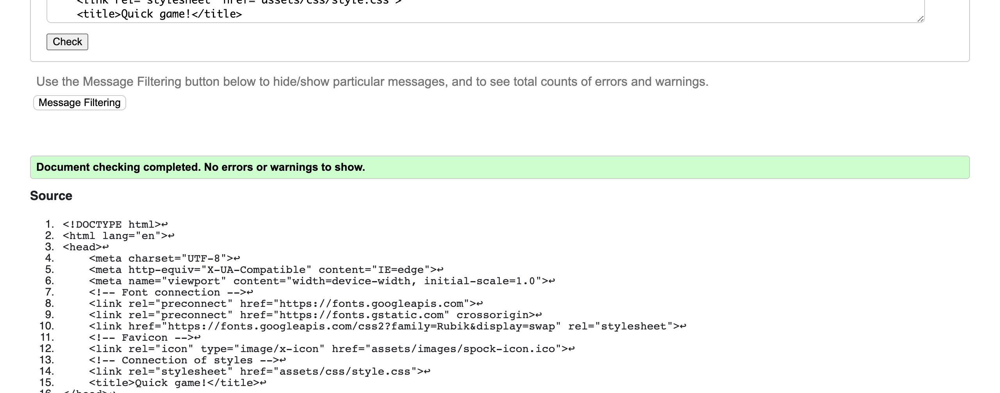
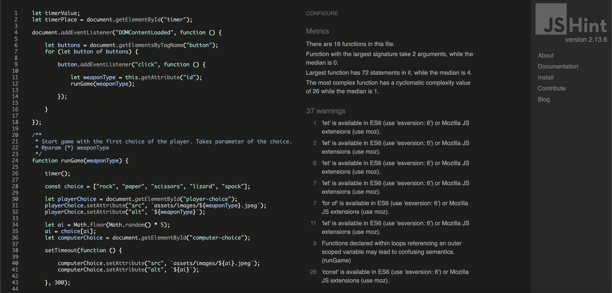
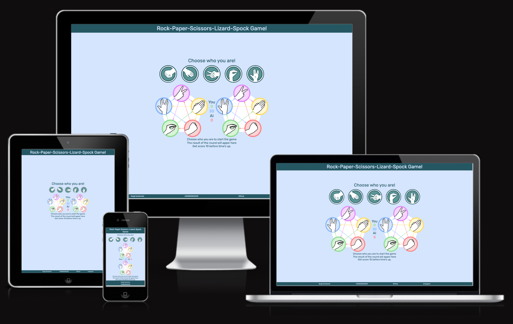
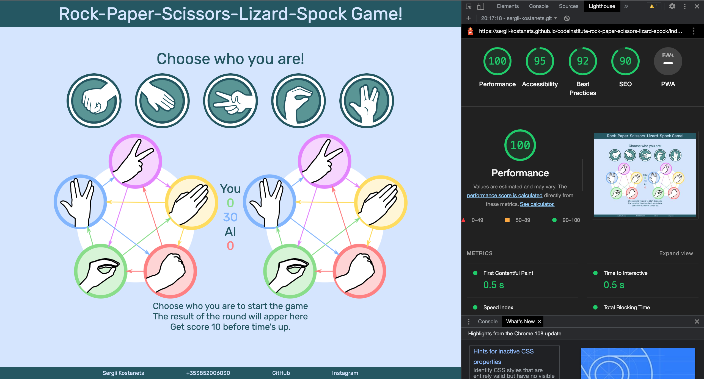

# Rock, Paper, Scissors, Lizard, Spock

## Contents

* [**Testing**](<#testing>)
  * [**Code Validation**](<#code-validation>)
  * [**Responsivenes**](<#responsivenes>)
  * [**Browser Compatibility**](<#browser-compatibility>)
  * [**Known Bugs**](<#known-bugs>)
    * [Resolved](<#resolved>)
    * [Unresolved](<#unresolved>)
  * [**Additional Testing**](<#additional-testing>)
    * [Lighthouse](<#lighthouse>)
    * [Peer review](<#peer-review>)

## Testing

### Code Validation

The [Rock-Paper-Scissors-Lizard-Spock Game](https://sergii-kostanets.github.io/codeinstitute-rock-paper-scissors-lizard-spock/) site has been throughly tested. All the code has been run through the [W3C HTML Validator](https://validator.w3.org/), the [W3C CSS Validator](https://jigsaw.w3.org/css-validator/) and the [JS hint Validator](https://jshint.com/). Minor errors were found. After a fix and retest, no errors were returned.

The HTML validator results are below:



The CSS validator results are below:


The JS validator results are below:



There are loads of warnings, but no errors.

[Back to top](<#contents>)

### Responsivenes

* The responsive design tests were carried out manually with [Google Chrome DevTools](https://developer.chrome.com/docs/devtools/) and [Am I Responsive](https://ui.dev/amiresponsive?url=https://sergii-kostanets.github.io/codeinstitute-photo-shoot-fans).

    |        | Galaxy Fold | Galaxy A51 | iPhone 5 | iPad Air | iPad Mini | Display <1200px | Display >1200px |
    |--------|-------------|------------|----------|----------|-----------|-----------------|-----------------|
    | Render | pass        | pass       | pass     | pass     | pass      | pass            | pass            |
    | Images | pass        | pass       | pass     | pass     | pass      | pass            | pass            |
    | Links  | pass        | pass       | pass     | pass     | pass      | pass            | pass            |

[Back to top](<#contents>)

* Website [Rock-Paper-Scissors-Lizard-Spock Game](https://sergii-kostanets.github.io/codeinstitute-rock-paper-scissors-lizard-spock/) has fully responsive design which looks amazing on any device, from widescreen monitors to the smallest mobile phone screens.

    The responsiveness of the game:

    

[Back to top](<#contents>)

### Browser Compatibility

[Rock-Paper-Scissors-Lizard-Spock Game](https://sergii-kostanets.github.io/codeinstitute-rock-paper-scissors-lizard-spock/) site was tested on the following browsers with no visible issues for the user.
Google Chrome, Opera, Microsoft Edge, Safari and Mozilla Firefox. Appearance, functionality and responsiveness were consistent throughout for a range of device sizes and browsers.

[Back to top](<#contents>)

### Known Bugs

* #### Resolved

  * Adding a timer prevented the scoring section from being hidden after the game ended. The countdown continued.
    * Approach 1:
    Taking the timer out of the scoring zone.
    * Approach 2 (chosen):
    Deleting rather than hiding a section: ```document.getElementById("timer").remove();```

[Back to top](<#contents>)

* #### Unresolved

  * If the buttons are pressed too quickly, the symbol selection button may be pressed again after the end of the last round. As a result, there may be a discrepancy between winning or losing a game with an explanation of the results of the last round that was played when it should not have been.
    * Approach 1:
    Removing the character selection buttons or replacing with text did not help. The button can still be pressed an additional time after the end of the game.

[Back to top](<#contents>)

### Additional Testing

#### Lighthouse

The site was also tested using [Google Lighthouse](https://developers.google.com/web/tools/lighthouse) in Chrome Developer Tools to test each of the pages for:

* Performance - How the page performs whilst loading.
* Accessibility - Is the site acccessible for all users and how can it be improved.
* Best Practices - Site conforms to industry best practices.
* SEO - Search engine optimisation. Is the site optimised for search engine result rankings.

As an example the results for [Rock-Paper-Scissors-Lizard-Spock Game](https://sergii-kostanets.github.io/codeinstitute-rock-paper-scissors-lizard-spock/) main page:



This part of the testing process showed up that the site was slow to load, mainly due to the image sizes. All the images needed to be compressed before adding to the repository. Once this was done the performance went from ~80% to ~100%.

[Back to top](<#contents>)

#### Peer review

In addition to the above testing the beta version of the site was put through its paces by peers, both in the software development field and outside. The results highlighted responsive design weakness for a type of mobile device that was rectified with minor CSS amendments. There were also minor spelling and grammar errors that have since been fixed.

[Back to top](<#contents>)

Back to [README.md](./README.md#testing).
